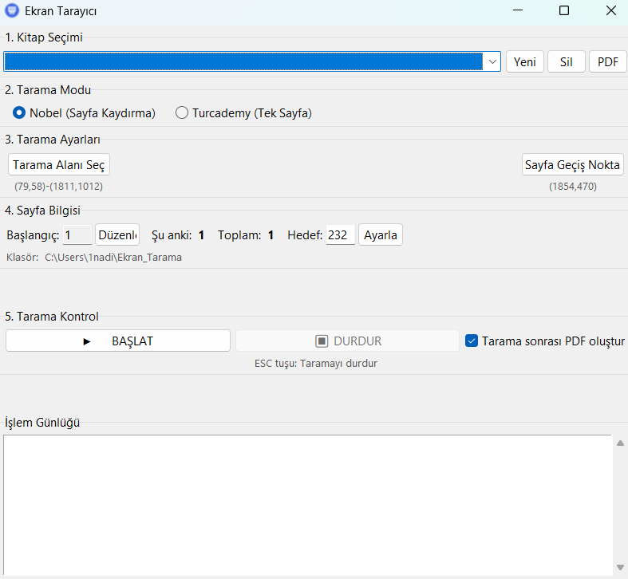

# Ekran Tarayıcı

Web sayfalarında bulunan pdfleri tarayıp PDF dosyasına dönüştüren kullanıcı dostu bir masaüstü uygulaması.

(Diyelim ki bir e-kitap satın aldınız ve indirip kullanmak istiyorsunuz bazı siteler buna müsade etmiyorlar sadece ekran görüntüsü alabiliyorsunuz bu işlem de çok uzun ve zahmetli o zaman ne yapacaksınız bu uygulamayı indirip başlatacaksınız kendi kendine tüm sayfaların ekran gröüntüsü alacak ve en son size pdf olarak verecek)



## Özellikler

- **Nobel Modu**: Uzun sayfaları kaydırarak tarar ve birleştirir
- **Turcademy Modu**: Her sayfayı tek görüntü olarak alır


- Tarama alanını ve sayfa geçiş noktasını görsel olarak seçme
- İşlem sırasında taramayı duraklatma/devam ettirme
- Hedef sayfa sayısı belirleme ve otomatik durdurma
- Tarama sonrası otomatik PDF oluşturma
- Kitapları yönetme (ekleme, silme)
- İlerleme otomatik kaydedilir, daha sonra kaldığınız yerden devam edebilirsiniz


## Kurulum

### Hazır Derlenmiş Sürüm (GELİŞTİREMİYİCİLER İÇİN)

1. [Releases](https://github.com/Nadirmermer/web-pdf-scanner/releases/tag/v0.1.0) sayfasından son sürümü indirin
2.  `Ekran_Tarayici.exe` dosyasını çalıştırın ve keyfinize bakın

### Kaynak Koddan Çalıştırma (GELİŞTİRİCİLER İÇİN)

Gereksinimler:
- Python 3.7 veya üzeri

```bash
# Gerekli kütüphaneleri yükleyin
pip install -r requirements.txt

# Uygulamayı çalıştırın
python ekran_tarayici.py
```

## Kullanım

### Uygulamanın Bölümleri ve İşlevleri

#### 1. Kitap Seçimi Bölümü
- **Açılır Liste**: Önceden oluşturduğunuz kitaplar arasından seçim yapabilirsiniz
- **Yeni**: Yeni bir kitap oluşturmanızı sağlar. Her kitap için ayrı bir klasör oluşturulur
- **Sil**: Seçili kitabı silmenizi sağlar (dikkatli kullanın!)
- **PDF**: Seçili kitabın taranmış sayfalarını PDF dosyasına dönüştürür. Bu buton, kitapta taranmış sayfalar olduğunda görünür

#### 2. Tarama Modu Bölümü
- **Nobel (Sayfa Kaydırma)**: Uzun sayfaları olan siteler için. Tarama alanındaki sayfayı yukarıdan aşağıya kaydırarak tarar ve parçaları birleştirir
- **Turcademy (Tek Sayfa)**: Her sayfayı tek görüntü olarak tarar. Sayfa geçişlerinde tıklama yapar

#### 3. Tarama Ayarları Bölümü
- **Tarama Alanı Seç**: Ekranınızda taranacak alanı seçmenizi sağlar. Tıkladığınızda mevcut ekranın görüntüsünü alır ve fare ile dikdörtgen seçimi yapmanızı bekler
- **Sayfa Geçiş Noktası**: Bir sonraki sayfaya geçmek için tıklanacak noktayı seçmenizi sağlar (örn: "Sonraki Sayfa" butonu)

#### 4. Sayfa Bilgisi Bölümü
- **Başlangıç**: Taramanın başlayacağı sayfa numarası
- **Düzenle**: Başlangıç sayfa numarasını değiştirmenizi sağlar
- **Şu anki**: Şu anda işlenen sayfa numarası
- **Toplam**: Şu ana kadar taranmış toplam sayfa sayısı
- **Hedef**: Taramanın duracağı sayfa numarası
- **Ayarla**: Hedef sayfa sayısını belirler. Bu sayıya ulaşıldığında tarama otomatik olarak durur

#### 5. Tarama Kontrol Bölümü
- **BAŞLAT**: Tarama işlemini başlatır. Tarama başladığında bir geri sayım başlar ve ekranınızda küçük bir kontrol paneli görünür
- **DURDUR**: Aktif tarama işlemini durdurur
- **Tarama sonrası PDF oluştur**: Bu seçenek işaretlendiğinde, tarama tamamlandığında otomatik olarak PDF oluşturulur

#### İşlem Günlüğü
- Uygulama tarafından gerçekleştirilen işlemleri ve hataları gösterir. Sorun yaşadığınızda buradaki mesajlar yardımcı olabilir

### Adım Adım Kullanım Kılavuzu

1. **Kitap Oluşturma ve Seçme**
   - Açılır listeden "-- Yeni Kitap Ekle --" seçin veya "Yeni" butonuna tıklayın
   - Kitap adını girin ve "Ekle" butonuna tıklayın
   - Oluşturulan kitap otomatik olarak seçilecektir

2. **Tarama Modunu Belirleme**
   - Taramak istediğiniz sitenin yapısına göre uygun modu seçin:
     - Nobel: Sayfaları kaydırmalı olarak görüntüleyen siteler için
     - Turcademy: Her sayfayı tek görüntü olarak gösteren siteler için

3. **Tarama Ayarlarını Yapma**
   - "Tarama Alanı Seç" butonuna tıklayın
   - Uygulama simge durumuna küçülecek ve ekranınız görüntülenecek
   - Taramak istediğiniz alanı fare ile seçin (e-kitabın görüntülendiği alan)
   - "Sayfa Geçiş Noktası" butonuna tıklayın
   - Bir sonraki sayfaya geçmek için tıklanacak noktayı fare ile seçin (genellikle "Sonraki Sayfa" butonu)

4. **Sayfa Bilgilerini Ayarlama**
   - Başlangıç sayfa numarasını kontrol edin, değiştirmek için "Düzenle" butonuna tıklayın
   - Hedef sayfa sayısını belirleyin ve "Ayarla" butonuna tıklayın

5. **Taramayı Başlatma ve Kontrol Etme**
   - Tarama sonrası otomatik PDF oluşturmak istiyorsanız ilgili kutucuğu işaretleyin
   - "BAŞLAT" butonuna tıklayın
   - Tarama başladığında ekranınızın sağ üst köşesinde küçük bir kontrol paneli görünecek
   - Bu panel üzerinden taramayı duraklatabilir veya durdurabilirsiniz
   - Tarama sırasında ESC tuşuna basarak da taramayı durdurabilirsiniz

6. **PDF Oluşturma**
   - Tarama tamamlandığında, "PDF" butonu görünecektir
   - Bu butona tıklayarak tüm taranmış sayfaları PDF dosyasına dönüştürebilirsiniz
   - Dosya adını ve konumunu belirledikten sonra PDF oluşturma işlemi başlayacaktır

### Önemli İpuçları

- Tarama başlamadan önce tarayacağınız web sayfasının hazır olduğundan emin olun
- Tarama sırasında fareyi hareket ettirmeyin ve başka işlemler yapmayın
- Geniş ekranlı monitör kullanıyorsanız, tarama alanını tam olarak belirleyin
- Uzun taramalar sırasında bilgisayarınızın uyku moduna geçmesini engelleyin
- Tarama tamamlandıktan sonra PDF'i kontrol edin; eksik sayfa varsa tekrar tarayabilirsiniz

### Kısayollar

- **ESC**: Taramayı durdur

## Teknik İyileştirmeler ve Kod Kalitesi

- **Kod Yeniden Düzenleme (Refactoring):** Kod tabanı okunabilirlik ve bakım kolaylığı için önemli ölçüde yeniden düzenlendi. Büyük fonksiyonlar daha küçük modüllere ayrıldı, sabitler tanımlandı ve kapsamlı tür ipuçları (type hinting) eklendi.
- **Bağımlılık Temizliği:** Kullanılmayan `PyPDF2` bağımlılığı kaldırıldı.
- **Gelişmiş Hata Yönetimi:** Hata yönetimi daha spesifik hale getirildi ve hatalar için kullanıcı geri bildirimi iyileştirildi.
- **Yapılandırma Esnekliği:** Temel operasyonel parametreler (bekleme süreleri, gecikmeler, benzerlik eşikleri vb.) artık `ayarlar.json` dosyası üzerinden yapılandırılabilir. Bu, kullanıcıların kaynak kodunu değiştirmeden uygulamanın davranışını ince ayar yapmasına olanak tanır.
- **Küçük Arayüz İyileştirmeleri:** Arayüzde tutarlı dolgu (padding) kullanımı ve kontrol panelindeki bilgi sunumunda iyileştirmeler yapıldı.

## Lisans

Bu proje MIT lisansı altında lisanslanmıştır. Detaylı bilgi için [LICENSE](LICENSE) dosyasına bakınız. 