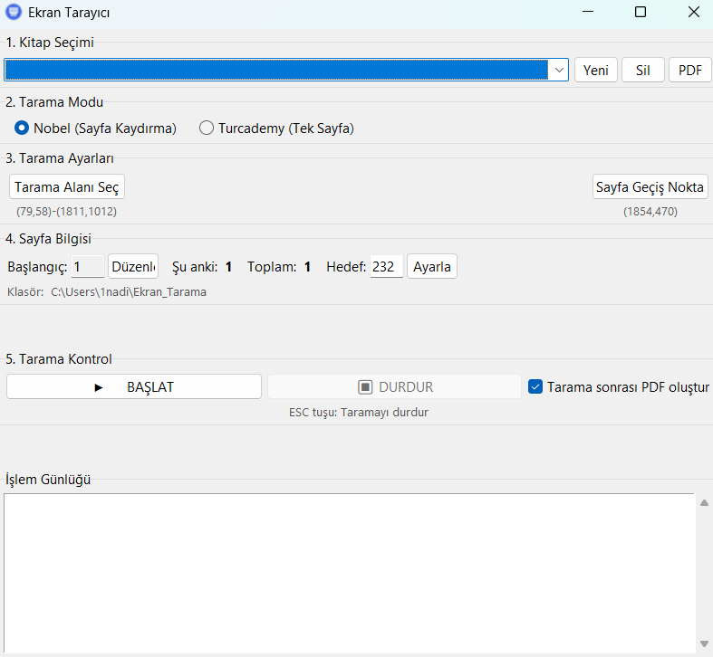
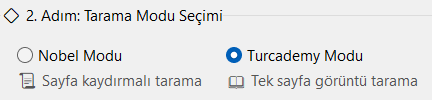
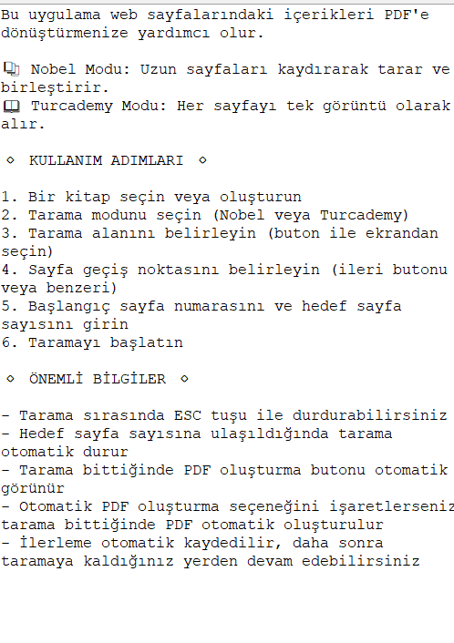

# Ekran Tarayıcı

Web sayfalarında bulunan pdfleri tarayıp PDF dosyasına dönüştüren kullanıcı dostu bir masaüstü uygulaması.

(Diyelim ki bir e-kitap satın aldınız ve indirip kullanmak istiyorsunuz bazı siteler buna müsade etmiyorlar sadece ekran görüntüsü alabiliyorsunuz bu işlem de çok uzun ve zahmetli o zaman ne yapacaksınız bu uygulamayı indirip başlatacaksınız kendi kendine tüm sayfaların ekran gröüntüsü alacak ve en son size pdf olarak verecek)



## Özellikler

- **Nobel Modu**: Uzun sayfaları kaydırarak tarar ve birleştirir
- **Turcademy Modu**: Her sayfayı tek görüntü olarak alır



- Tarama alanını ve sayfa geçiş noktasını görsel olarak seçme
- İşlem sırasında taramayı duraklatma/devam ettirme
- Hedef sayfa sayısı belirleme ve otomatik durdurma
- Tarama sonrası otomatik PDF oluşturma
- Kitapları yönetme (ekleme, silme)
- İlerleme otomatik kaydedilir, daha sonra kaldığınız yerden devam edebilirsiniz




## Kurulum

### Hazır Derlenmiş Sürüm

1. [Releases](https://github.com/Nadirmermer/web-pdf-scanner/releases/tag/v0.1.0) sayfasından son sürümü indirin
2.  `Ekran_Tarayici.exe` dosyasını çalıştırın ve keyfinize bakın

### Kaynak Koddan Çalıştırma (GELİŞTİRİCİLER İÇİN)

Gereksinimler:
- Python 3.7 veya üzeri

```bash
# Gerekli kütüphaneleri yükleyin
pip install -r requirements.txt

# Uygulamayı çalıştırın
python ekran_tarayici.py
```

## Kullanım

1. **Kitap Seçimi**: Yeni bir kitap oluşturun veya mevcut birini seçin
2. **Tarama Modu**: Nobel veya Turcademy modunu seçin
3. **Tarama Ayarları**: Tarama alanını ve sayfa geçiş noktasını belirleyin
4. **Sayfa Bilgisi**: Başlangıç ve hedef sayfa sayısını ayarlayın
5. **Tarama Kontrol**: Taramayı başlatın ve kontrol paneli ile yönetin


### Kısayollar

- **ESC**: Taramayı durdur (şüpheli siz yine de paneli kullanın)


## Lisans

Bu proje MIT lisansı altında lisanslanmıştır. Detaylı bilgi için [LICENSE](LICENSE) dosyasına bakınız. 